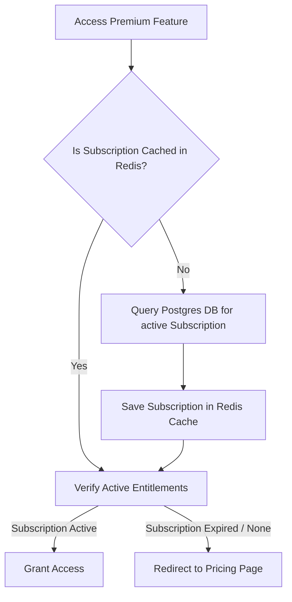
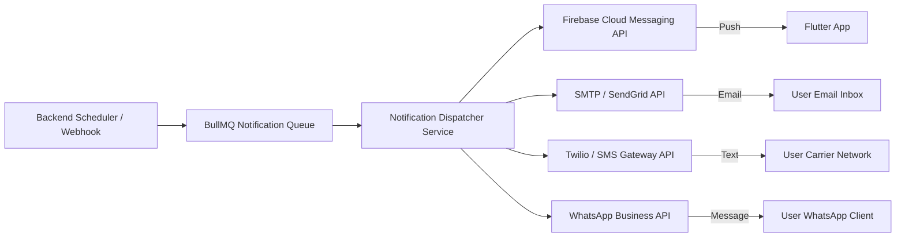

# Planova - Security, Subscription, and Notification Architecture

This document defines the security boundaries, data protection mechanisms, subscription lifecycle logic, and multi-channel notification architecture.

---

## 1. Security Architecture

### 1.1. Data Shielding and Privacy Design
Planova prioritizes user privacy. System administrators, support agents, and standard managers cannot view private schedules, event titles, tasks, or preferences by default.

* **Audit Escalatibility**: If a support ticket requires calendar investigation:
  1. The user must toggle a "Support Access Grant" inside their app settings.
  2. The agent must specify a business justification.
  3. The system creates a permanent `AuditLog` mapping the actor, reason, timestamp, and accessed resource.
  4. Access automatically expires after 24 hours.

### 1.2. Cryptographic Protocols
* **Password Hashing**: Passwords are hashed on the backend using Argon2id (parameters: memoryCost=65536, timeCost=3, parallelism=4) to mitigate GPU brute-force attacks.
* **Sensitive Credentials**: Third-party calendar refresh tokens and AI provider keys are encrypted before database insertion using AES-256-GCM. The encryption key is rotated periodically and loaded from a secure vault (e.g., AWS Secrets Manager).

### 1.3. API Protections
* **CORS Policies**: Strict whitelist matching domain names (e.g., `*.planova.ai`).
* **CSRF Mitigation**: Double-submit cookie patterns for web clients.
* **Brute-Force Rate Limiting**: NestJS `@nestjs/throttler` intercepts logins, capping attempts to 5 per IP per minute.

---

## 2. Subscription & Payment Architecture

### 2.1. Entitlement Management
Plans are validated through active subscription states:

### 2.2. Gateway Integrations
* **Stripe**: Primary billing engine for international credit cards, managing recurring subscriptions via Stripe Webhooks (`customer.subscription.updated`, `invoice.payment_succeeded`).
* **Paystack & Flutterwave**: Regional billing engines for African markets (Nigeria, Kenya, South Africa, etc.) supporting card, bank transfer, and mobile money.
* **Mobile In-App Purchases (IAP)**: Android Play Billing and iOS App Store In-App Purchases. Planova handles purchase verification server-side by validating receipt tokens against Google Play Developer APIs and Apple StoreKit App Store APIs.

---

## 3. Notification Architecture

To keep notifications synced across multiple platforms and timezones, the backend publishes messages to a high-throughput notifications dispatch service.

### 3.1. Timezone-Aware Notification Scheduling
* Alarms and event reminders are stored in UTC in the central database.
* The Flutter app parses UTC times into local system timezone offsets (`timezone` package).
* For server-sent push notifications, user preferred offsets are updated continuously (`UserPreference.timezone`). Web background workers calculate offsets dynamically before executing Send actions.

### 3.2. Delivery Channels
1. **Push Notifications**: Firebase Cloud Messaging (FCM) handles remote background wake-ups.
2. **Local Notifications**: scheduled using `flutter_local_notifications` for offline reliability.
3. **Email**: SendGrid or transactional SMTP servers for onboarding, password resets, and audit alerts.
4. **SMS & WhatsApp**: Gateways prepared via Twilio Integration wrappers for high-priority alerts (e.g., OTP validation, suspicious account activity).
