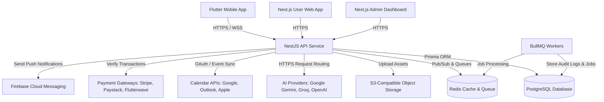
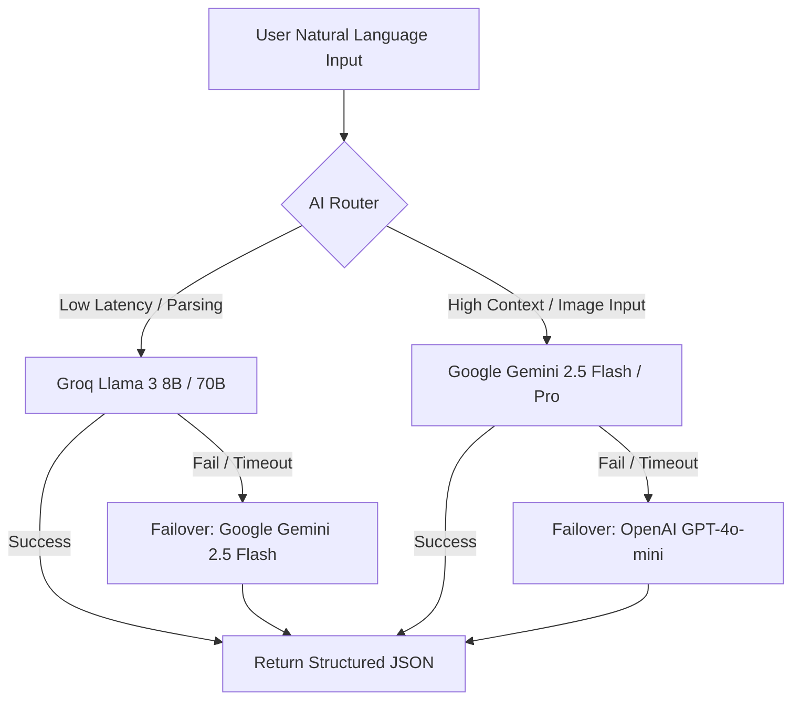

# Planova - System Architecture and Engineering Design

This document details the software architecture, system interactions, API patterns, AI routing configurations, and deployment strategies of the Planova platform.

---

## 1. High-Level Architecture

The Planova system is designed using a decoupled, service-oriented monorepo layout. 

* **Frontend Clients**: The cross-platform Flutter Mobile app utilizes native platform modules for calendar synchronization and hardware-level alarms. User and Admin Web apps are built with Next.js for server-side optimization and responsive layout support.
* **Backend API (NestJS)**: Written in TypeScript, utilizing Prisma ORM for type-safe database queries. Employs controllers, services, guards, and custom interceptors.
* **Message Queue & Caching (Redis/BullMQ)**: Redis serves as an in-memory cache and state broker for WebSocket events. BullMQ manages asynchronous, failure-tolerant background execution loops (e.g., calendar syncing, AI schedule calculation, push notifications).

---

## 2. API Architecture

### 2.1. Communication Channels
* **REST API**: Standard endpoints for CRUD operations (Events, Tasks, User settings) protected by role-based authentication.
* **WebSockets**: Real-time event transport for focus sessions, alarm states, collaboration updates, and AI generation progress streams.

### 2.2. Authentication & Session Management
* **JWT Access Token**: Short-lived (15 minutes), containing the user ID, active roles, and organization scope.
* **Refresh Token Rotation**: Stored securely in HTTP-only cookies (Web) or encrypted keychains (Mobile). On token refresh, the old token is invalidated, and a new pair is issued to mitigate replay attacks.
* **Brute-Force Protection**: Requests are rate-limited on a per-IP and per-user basis. Auth endpoints are capped at 5 requests/minute.

---

## 3. AI Routing & Multi-Provider Architecture

To guarantee high availability, low latency, and cost efficiency, Planova does not rely on a single AI provider. An abstract routing layer evaluates queries based on:
1. **Capabilities**: Routing complex constraint satisfaction to Google Gemini, and fast natural language parsing to Groq.
2. **Latency**: Measuring provider round-trip times and choosing the fastest available model.
3. **Availability / Failover**: Catching provider errors (e.g., 429 rate limits, 503 service unavailable) and immediately retrying with a fallback model.

### Routing Modes
* **Priority Routing**: Top-tier models are hit first; low-tier act as fallbacks.
* **Weighted Routing**: Percentage-based distribution of traffic to manage API token quotas.
* **Capability Routing**: Specific models assigned to specific tasks (e.g., Gemini for screenshot extraction and schedule generation; Groq for conversational edits).

---

## 4. Deployment Architecture

Planova's multi-tier deployment plan supports horizontal scaling:

| Tier | Technology | Platform | Scaling Strategy |
| :--- | :--- | :--- | :--- |
| **API Backend** | NestJS / Docker | AWS ECS Fargate or Fly.io | Auto-scale on CPU/Memory usage (>70%) |
| **User Web App** | Next.js / React | Vercel or Netlify | Global CDN replication |
| **Admin Dashboard** | Next.js / React | Vercel or Netlify | Global CDN replication |
| **Primary Database** | PostgreSQL | Neon or Supabase | Serverless auto-scaling compute, read replicas |
| **Job Queue / Cache** | Redis | Upstash or Managed AWS Elasticache | Multi-AZ replication, persistence enabled |
| **Object Storage** | S3-Compatible | AWS S3 or Cloudflare R2 | CDN-cached static asset delivery |
| **CI/CD Pipeline** | GitHub Actions | Runner VMs | Automated testing, docker packaging, staging deploy |
