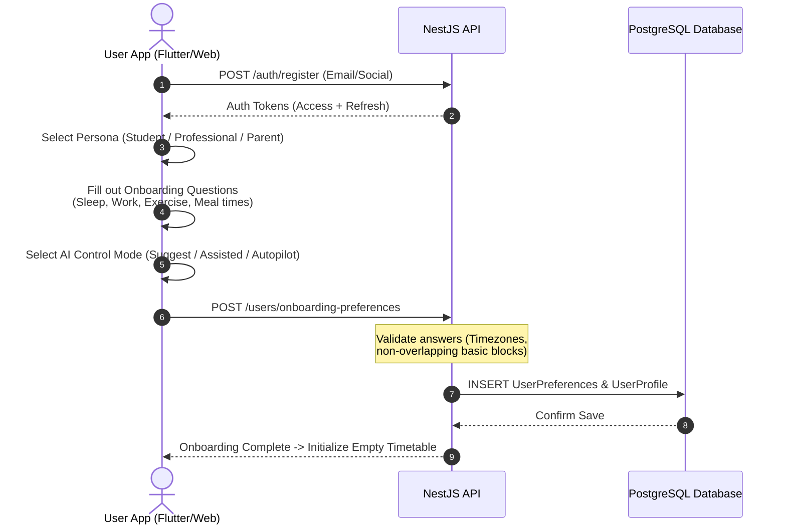
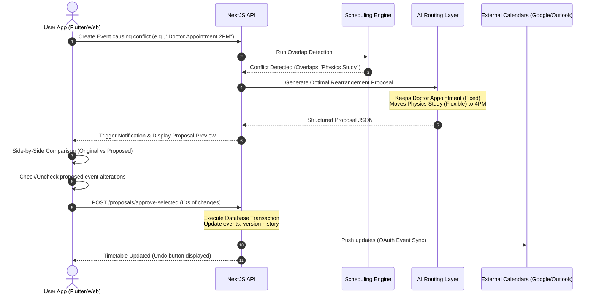
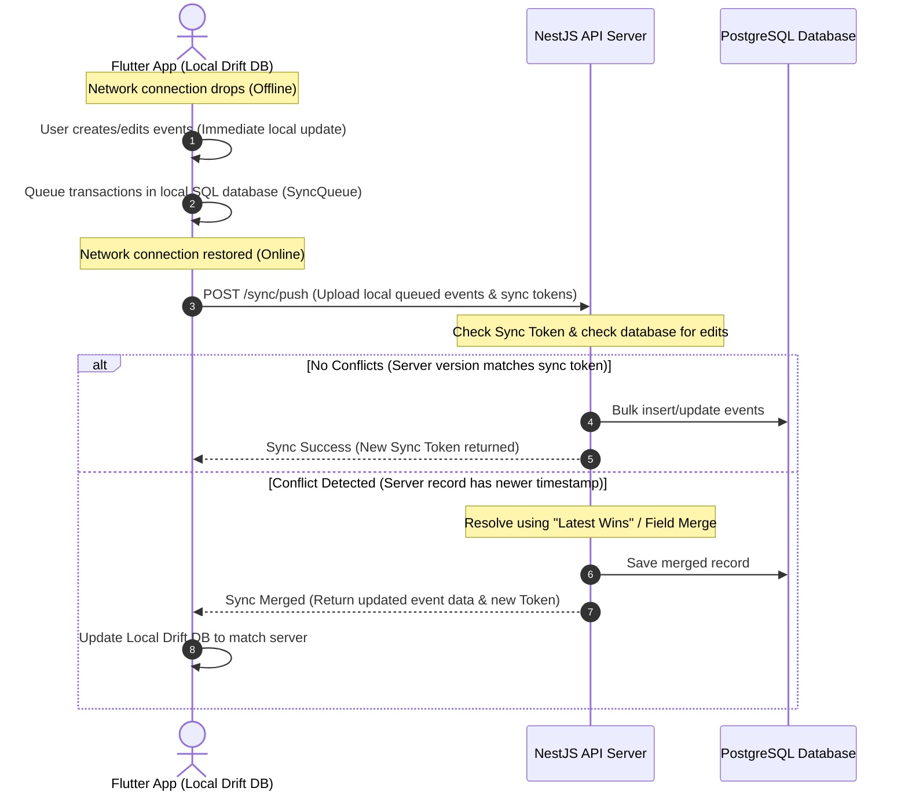

# Planova - User Roles, Permissions, and Journeys

This document defines the user role taxonomy, permission access levels, and core user journey flows for the Planova platform.

---

## 1. User Roles & Permissions Matrix

Planova implements a Role-Based Access Control (RBAC) matrix that maps distinct system actions to authorized users:

| Role | Target Audience | Key Access Permissions |
| :--- | :--- | :--- |
| **Guest** | Unauthenticated visitors | View public landing pages, pricing plans, and public/shared read-only timetables. |
| **Free User** | Default registered user | Create 1 timetable, manual scheduling, basic alarms. Ad-supported, capped AI usage (3 requests/day). |
| **Premium User** | Paid personal subscribers | Unlimited timetables, full AI features, advanced alarms/challenges, external calendar sync. |
| **Student** | Academic tier users | Special educational templates, homework/exam tracking, syllabus integration, and spacer repetition scheduling. |
| **Teacher** | Educators / Instructors | Create classes, publish syllabi, broadcast events/assignments to study groups, and track student check-ins. |
| **Parent** | Families / Guardians | View children's schedules, configure protected study times, manage notifications, and edit shared family calendars. |
| **Professional** | Work-focused subscribers | Advanced shift rotations, project timeline tracking, calendar overlays, and invoice/timesheet generation. |
| **Org Member** | Employees / Students in Org | Read/edit shared organizational timetables, check-in to events, and share individual availability. |
| **Org Admin** | Managers / Directors | Manage organization workspace, customize templates, provision member licenses, and set custom branding. |
| **Support Agent** | Customer service | View system audit logs, respond to tickets, and temporarily escalate permissions to troubleshoot non-private data. |
| **Admin** | System administrators | Manage support tickets, run database health reports, verify third-party keys, and ban offending users. |
| **Super Admin** | Platform owners | Full control of app settings, edit AI provider configurations/keys, manage system billing, and access all operational logs. |

---

## 2. Core User Journeys

### 2.1. Onboarding and AI Preference Collection

This journey maps the onboarding process where Planova collects constraints and preferences to build the user's initial schedule optimization matrix.

---

### 2.2. Conflict Resolution & AI Proposal Approval Loop

This is the core Planova differentiator: conflicts trigger an AI rearrangement proposal, which is presented side-by-side to the user for selective approval.

---

### 2.3. Offline-First Synchronization Loop

How the client operates while disconnected and merges conflicting changes upon reconnection.

