# Planova - Database Entity Relationship Design

This document details the PostgreSQL schema, model definitions, index optimizations, audit requirements, and enums designed for Prisma ORM.

---

## 1. Database Schema Overview (ERD)

The database schema utilizes UUIDs for all primary keys, enforces strict foreign key constraints, supports soft deletes where applicable, and records timestamps for all table entries.

```mermaid
erDiagram
    USER ||--o| USER_PROFILE : "has"
    USER ||--o| USER_PREFERENCE : "defines"
    USER ||--o{ USER_DEVICE : "registers"
    USER ||--o{ USER_SESSION : "establishes"
    USER ||--o{ REFRESH_TOKEN : "rotates"
    USER ||--o{ USER_ROLE : "assigned"
    USER ||--o{ ORGANIZATION_MEMBER : "member of"
    USER ||--o{ CALENDAR_ACCOUNT : "integrates"
    USER ||--o{ TIMETABLE : "owns"
    USER ||--o{ TASK : "manages"
    USER ||--o{ GOAL : "tracks"
    USER ||--o{ ROUTINE : "performs"
    USER ||--o{ FOCUS_SESSION : "runs"
    USER ||--o{ AUDIT_LOG : "triggers"
    USER ||--o{ SUPPORT_TICKET : "submits"
    
    ORGANIZATION ||--o{ ORGANIZATION_MEMBER : "has"
    ORGANIZATION ||--o{ TIMETABLE : "shares"
    
    SUBSCRIPTION_PLAN ||--o{ SUBSCRIPTION : "defines"
    USER ||--o| SUBSCRIPTION : "pays for"
    SUBSCRIPTION ||--o{ PAYMENT_TRANSACTION : "bills"
    COUPON ||--o{ SUBSCRIPTION : "discounts"
    
    TIMETABLE ||--o{ TIMETABLE_VERSION : "tracks"
    TIMETABLE ||--o{ EVENT : "contains"
    TIMETABLE ||--o{ SHARED_TIMETABLE : "shared to"
    
    EVENT ||--o{ EVENT_RECURRENCE : "defines pattern"
    EVENT ||--o{ EVENT_PARTICIPANT : "invites"
    EVENT ||--o{ EVENT_REMINDER : "schedules alerts"
    EVENT ||--o{ ALARM : "fires"
    ALARM ||--o| ALARM_SOUND : "plays"
    
    TASK ||--o{ TASK_DEPENDENCY : "depends on"
    
    SCHEDULE_PROPOSAL ||--o{ SCHEDULE_CHANGE : "proposes"
    SCHEDULE_PROPOSAL ||--o{ SCHEDULE_APPROVAL : "requests approval"
    
    AI_PROVIDER ||--o{ AI_PROVIDER_KEY : "encrypts keys"
    AI_PROVIDER ||--o{ AI_MODEL : "hosts"
    AI_MODEL ||--o{ AI_REQUEST : "executes"
    USER ||--o{ AI_USAGE : "consumes quota"
```

---

## 2. Core Enums

* **UserStatus**: `ACTIVE`, `PENDING_VERIFICATION`, `SUSPENDED`, `DELETED`
* **UserRoleType**: `SUPER_ADMIN`, `ADMIN`, `SUPPORT_AGENT`, `ORG_ADMIN`, `ORG_MEMBER`, `PARENT`, `TEACHER`, `STUDENT`, `PROFESSIONAL`, `PREMIUM_USER`, `FREE_USER`, `GUEST`
* **SubscriptionStatus**: `ACTIVE`, `TRIALING`, `PAST_DUE`, `CANCELED`, `UNPAID`, `GRACE_PERIOD`
* **EventType**: `WORK`, `SCHOOL`, `EXERCISE`, `MEAL`, `SLEEP`, `PRAYER`, `PERSONAL`, `OTHER`
* **EventFlexibility**: `FIXED`, `SEMI_FLEXIBLE`, `FLEXIBLE`, `LOCKED`
* **EventStatus**: `CONFIRMED`, `TENTATIVE`, `CANCELLED`
* **TimetableStatus**: `ACTIVE`, `DRAFT`, `ARCHIVED`
* **ProposalStatus**: `PENDING`, `APPROVED`, `PARTIALLY_APPROVED`, `REJECTED`, `EXPIRED`, `UNDONE`
* **ScheduleChangeType**: `CREATE`, `UPDATE`, `DELETE`, `MOVE`
* **ApprovalAction**: `APPROVE`, `REJECT`, `EDIT`
* **AIProviderStatus**: `ACTIVE`, `DEGRADED`, `INACTIVE`
* **CalendarProvider**: `GOOGLE`, `OUTLOOK`, `APPLE`
* **NotificationType**: `PUSH`, `EMAIL`, `SMS`, `WHATSAPP`, `IN_APP`
* **AlarmStatus**: `SCHEDULED`, `SNOOZED`, `DISMISSED`, `MISSED`
* **PaymentStatus**: `SUCCESSFUL`, `FAILED`, `PENDING`, `REFUNDED`

---

## 3. Data Models Specification

All models contain the following audit and tracking fields:
* `id`: `UUID` (Primary Key)
* `createdAt`: `DateTime` (Default `NOW()`)
* `updatedAt`: `DateTime` (Updated automatically on edit)
* `deletedAt`: `DateTime` (Nullable, for soft-delete)
* `createdBy`: `UUID` (Nullable, references User)
* `updatedBy`: `UUID` (Nullable, references User)

### Key Model Definitions

#### User Management
* **User**: Core account model. Contains email (indexed, unique), password hash (Argon2), user status, and multi-factor flags.
* **UserProfile**: Extended details (first name, last name, phone, bio, avatar URL, persona selection).
* **UserPreference**: AI optimization preferences (Suggest/Assisted/Autopilot modes, wake/sleep windows, break durations, protected time slots, travel padding time).
* **UserDevice**: FCM device tokens (unique), platform indicators (Android/iOS/Web), version logs.
* **UserSession**: Active session state, client IP address, user agent, verification flags.
* **RefreshToken**: Cryptographic rotation tokens (hashed, unique, linked to sessions).

#### Membership & Billing
* **Role / Permission / UserRole**: Core RBAC mappings allowing granularity in endpoint enforcement.
* **Organization / OrganizationMember**: Corporate/Academic scopes allowing multi-tenant controls.
* **SubscriptionPlan / Subscription / Payment / PaymentTransaction / Coupon**: Billing state, regional currency pricing, transaction records, coupon application histories.

#### Timetable & Calendar
* **Timetable**: Named timetable container (e.g., "Fall 2026"), status, associated timezone.
* **TimetableVersion**: Copy of state used for historical rollback and backup reference during AI rearrangements.
* **Event**: Title, description, timezone, startTime, endTime, flexibility level, categories, travel duration, preparation duration.
* **EventRecurrence**: RFC 5545 recurrence rules (FREQ, INTERVAL, BYDAY, UNTIL).
* **EventParticipant**: Invitee tracking, status (accepted/declined/tentative), role.
* **EventReminder / Alarm / AlarmSound**: User notification settings, alarm statuses (Snoozed/Dismissed), wake challenge definitions, and local media references.

#### Task & Routine Management
* **Task / TaskDependency**: Nested TODO elements, checklist entries, priority, due dates, flexibility windows, and prerequisite mappings.
* **Routine**: Recurring habits (medication, daily exercises) trackable via streaks.
* **Goal**: High-level targets, milestones, and status.
* **FocusSession**: Pomodoro logs, interruption counts, estimated vs actual duration.

#### AI Planning & Audits
* **ScheduleProposal / ScheduleChange / ScheduleApproval**: Mappings of AI-suggested schedule changes showing delta states (Original vs. Proposed) and tracking user choices (Accept/Reject/Modify).
* **AIProvider / AIProviderKey / AIModel / AIRequest / AIUsage**: Administration tools tracking latency, token usage, encrypted provider credentials, model metrics, and user rate limits.
* **AuditLog**: Platform-wide activity logging (action type, target resource, actor user, metadata).
* **SupportTicket**: Customer service request records.
* **AppSetting / FeatureFlag**: Toggle configurations managed globally.
