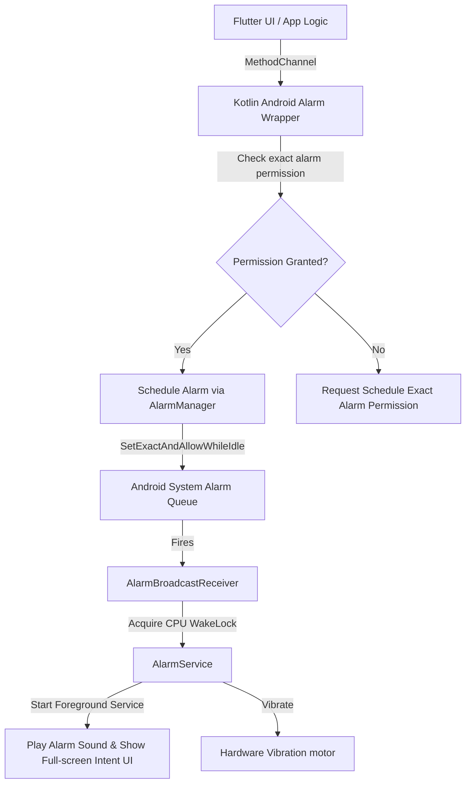

# Planova - Alarm and Custom Sound Architecture

This document details the native integration and background execution architecture for scheduling alarms, reminders, challenges, and custom audio assets on Android and iOS.

---

## 1. Native Platform Integrations

Because of deep permission differences and sandbox rules, Android and iOS require distinct background and scheduling pipelines.

### 1.1. Android Native Alarms

Android allows deep hardware control over scheduling exact alarms that fire even when the device is asleep or in Doze mode.

* **Scheduling API**: Use `AlarmManager.setExactAndAllowWhileIdle()` to ensure microsecond-level accuracy.
* **Exact Alarm Permission**: Targets Android 12+ (API 31+) requiring `<uses-permission android:name="android.permission.SCHEDULE_EXACT_ALARM"/>` and runtime verification.
* **Reboot Rescheduling**: Register a broadcast receiver for `android.intent.action.BOOT_COMPLETED`. Upon reboot, the application queries the SQLite database (Drift/Isar) and re-schedules all future alarms.
* **Battery Optimizations**: Prompts users to add Planova to the battery optimization whitelist (`ACTION_REQUEST_IGNORE_BATTERY_OPTIMIZATIONS`) to prevent background services from being terminated by custom manufacturer policies (e.g., Samsung, Xiaomi background restrictions).

### 1.2. iOS Native Alarms

iOS implements a stricter security sandbox. Third-party applications cannot wake up arbitrary background audio threads or launch overlay screens when the device is locked or the application is closed.

* **Scheduling API**: Use the `UserNotifications` framework (`UNUserNotificationCenter`). Reminders are queued as local notifications with sound triggers.
* **Background Limitation**: iOS notifications are scheduled locally. When the phone is locked, the notification triggers, displaying the alert and playing a custom sound file.
* **Sound Constraints**: iOS limits local notification sounds to **30 seconds**. Custom sounds must be packaged in the app bundle or downloaded to the app container beforehand, in supported formats (`.caf`, `.wav`, `.aiff`).
* **Background Audio**: Packaged custom audio playlists (like Apple Music or Spotify API streams) cannot be booted directly while the app is killed. The app can play background streams *only* if the user launches the app via the notification click.

---

## 2. Alarm Challenges

To silence a scheduled alarm, the user must satisfy selected cognitive or physical tests:

1. **Mathematics Challenge**: Randomly generated equations (e.g., `(23 * 4) - 17 = ?`) with varying difficulty (Easy, Medium, Hard). The alarm remains active until the correct input is submitted.
2. **QR / Barcode Scan**: The user must scan a pre-selected QR code (e.g., taped in the bathroom or kitchen) using the device camera.
3. **Step Count**: Silencing triggers the accelerometer and step counter (`pedometer` plugin). The alarm is disabled only when the user takes a configured number of steps (e.g., 30 steps).
4. **Typing Challenge**: Requires writing a random motivational phrase exactly as presented.
5. **Memory Puzzle**: A grid-matching card game (Simon-style or sequence memory).
6. **Shake Challenge**: Counts device movements via the gyroscope and accelerometer until the threshold is crossed.

---

## 3. Platform Technical Comparison

| Feature | Android | iOS |
| :--- | :--- | :--- |
| **Exact Firing** | Supported (`AlarmManager`) | Supported (`UNNotificationRequest`) |
| **Full-Screen Wake Intent** | Supported (Overlay activity) | Unsupported (Interactive Notification Banner only) |
| **Unlimited Sound Loop** | Supported via Background Service | Restricted to 30 seconds per notification trigger |
| **System Volume Override** | Supported (Audio Manager API) | Unsupported (Volume controlled by Ringtone/Alerts slider) |
| **Snooze Logic** | Client-managed scheduling loop | Scheduled via secondary local notifications |
| **Challenge Execution** | Runs immediately inside Overlay activity | User must swipe notification to launch app and run challenge |
