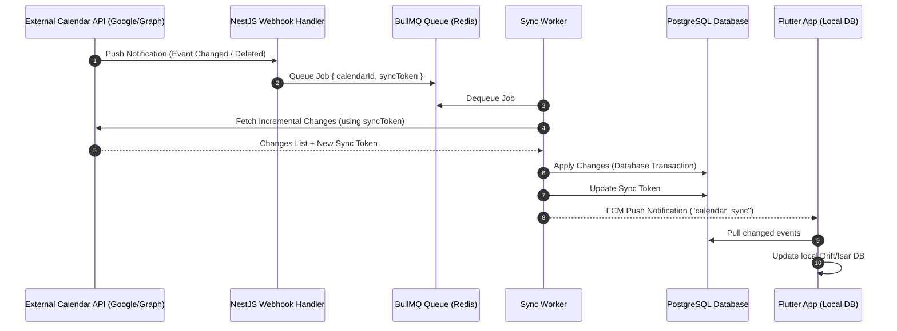
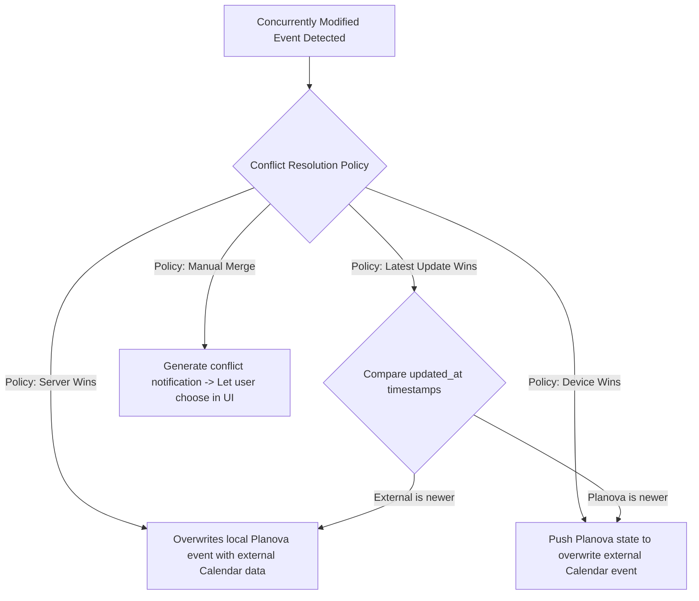

# Planova - Calendar Synchronization Architecture

This document defines the architecture, synchronization flows, and integration details for Google Calendar, Microsoft Outlook, and Apple Calendar.

---

## 1. Synchronization Flow

Planova operates on a hybrid calendar synchronization engine:
* **Web-Based Third-Party Calendars (Google & Outlook)**: Server-to-server sync engine leveraging background queue workers (BullMQ) and push notification webhooks.
* **Device-Level Calendars (Apple EventKit)**: Client-side native synchronization operating directly on the device using Swift/Kotlin wrappers exposed to Flutter.

### Web Calendar Sync Engine (Google & Microsoft)

---

## 2. Platform Integrations

### 2.1. Google Calendar Integration
* **API Details**: Google Calendar REST API v3.
* **Authentication**: OAuth 2.0 via `google_sign_in` on mobile, storing encrypted `accessToken`, `refreshToken`, and expiration timestamps on the backend.
* **Sync Strategy**:
  1. Initialize connection using OAuth.
  2. Perform full sync: fetch all events, store events, save Google `syncToken`.
  3. Register webhooks via `calendars.watch()`, sending updates to `https://api.planova.ai/v1/sync/google/webhook`.
  4. Incremental Sync: When webhook fires, request changes using the stored `syncToken` to retrieve only modified/deleted events.

### 2.2. Microsoft Outlook Calendar Integration
* **API Details**: Microsoft Graph API v1.0.
* **Authentication**: Azure AD OAuth 2.0 flow.
* **Sync Strategy**:
  1. Execute initial sync.
  2. Implement Outlook delta queries (using `@odata.deltaLink`) for incremental updates.
  3. Set up MS Graph change notifications subscription for real-time push.

### 2.3. Apple Calendar Integration (iOS Device Calendar)
* **API Details**: Apple EventKit framework.
* **Access Strategy**:
  * Because Apple Calendar does not offer public server-to-server webhooks for iCloud accounts without complex MDM/Enterprise profiles, synchronization is handled **locally** on the mobile client.
  * We use native Swift integration via Flutter MethodChannels to communicate with `EKEventStore`.
  * The app requests read/write access to the iOS Calendar database.
  * Background Fetch: The Flutter app triggers periodic native background checks (using iOS background tasks) to scan the local event store for modifications, publishing updates back to the Planova backend.

---

## 3. Conflict Resolution Strategy

When an event is modified concurrently in both Planova and an external calendar, the following logic applies:

* **Locked Event Rule**: Under no circumstances can external calendar modifications override an event locked by the user in Planova.
* **Deduplication Key**: External events are stored with their provider ID (e.g., `googleEventId`, `outlookEventId`, `appleEventId`) mapping uniquely to prevent duplicates.
