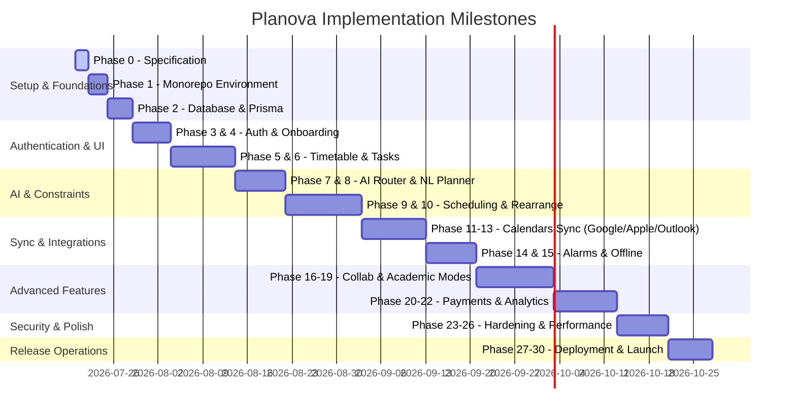

# Planova - Testing Strategy and Development Roadmap

This document defines the quality assurance frameworks, testing strategies, and the incremental release roadmap for Planova.

---

## 1. Testing Strategy

Planova enforces a strict testing pyramid across all components in the monorepo:

```text
    / \
   /   \      E2E / Playwright / Widget (Top 10%)
  /-----\
 /       \    Integration / Service APIs (Middle 30%)
/---------\
/           \  Unit Tests / Models / Utilities (Base 60%)
-------------
```

### 1.1. Backend API (NestJS)
* **Unit Testing**: Jest for business logic isolated from database interactions. Mocks Prisma clients.
* **Integration Testing**: Jest and supertest against a Dockerized test database instance. Runs database migrations and validates seed queries.
* **End-to-End Testing**: Validates whole request pipelines, authentication middleware, and error-handling interceptors.

### 1.2. Flutter Mobile Client
* **Unit Testing**: Tests Dart business rules, Riverpod providers, and utility classes.
* **Widget Testing**: Tests isolated UI components to verify layout, labels, and state mutations under mocked inputs.
* **Integration Testing**: End-to-end integration tests using `flutter_driver` or `integration_test` package running on simulators or actual hardware.
* **Golden Tests**: Visual regression testing using `golden_toolkit` to verify visual consistency across platforms and resolutions.

### 1.3. Web Clients (User-Web & Admin-Web)
* **Component Testing**: React Testing Library and Vitest for testing Next.js layouts and UI states.
* **End-to-End Testing**: Playwright for verifying user flows (registration, dragging events on the timetable, clicking approval modals).

---

## 2. Development Roadmap & Release Phases

The project progresses in grouped phases, with strict verification checks required to transition:



### Milestone Groupings
1. **Infrastructure (Phases 1-2)**: Monorepo construction, database migrations, Docker configs.
2. **Core App (Phases 3-6)**: Authentication, User Profiles, Calendar Views, Drag-and-drop Events.
3. **AI Scheduling (Phases 7-10)**: NL parser, dynamic scoring constraint solver, side-by-side proposal preview logic.
4. **Integrations (Phases 11-16)**: Third-party calendar sync tokens, native Swift/Kotlin EventKit wrappers, foreground service alarms, FCM pushes.
5. **Business/Niche Logic (Phases 17-22)**: Student Mode, Professional Shifts, Sharing metrics, payment plans.
6. **Hardening & Launch (Phases 23-30)**: Audits, localizations, E2E tests, build profiling, App Store delivery.
